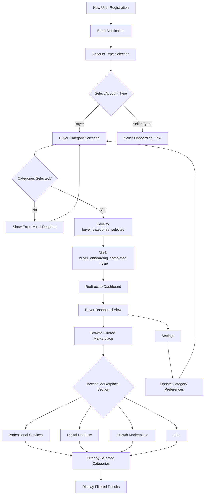
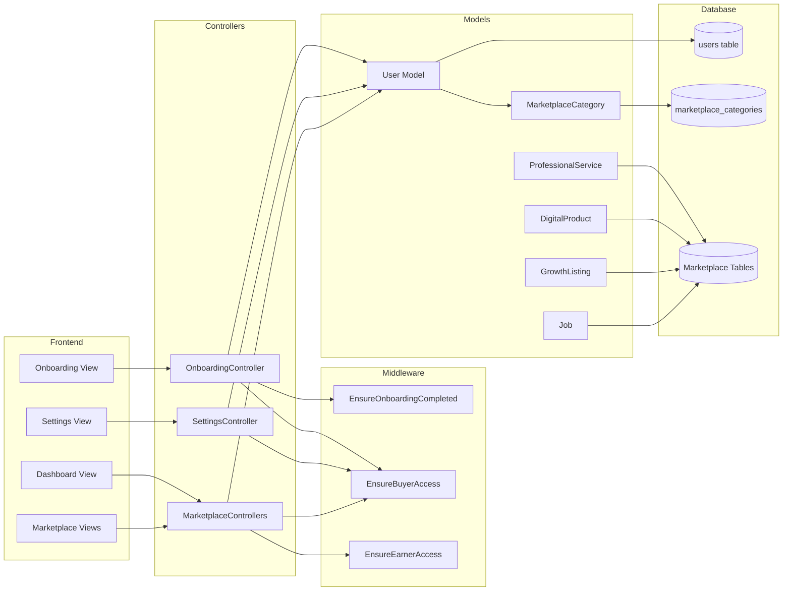
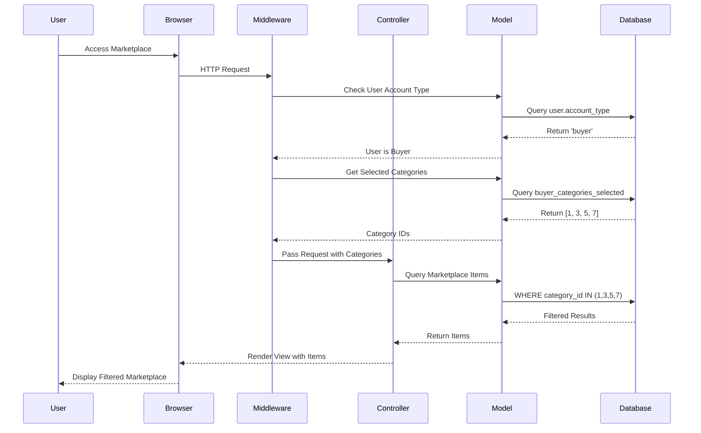
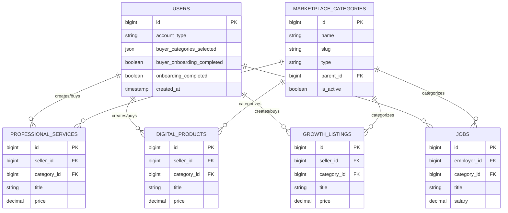
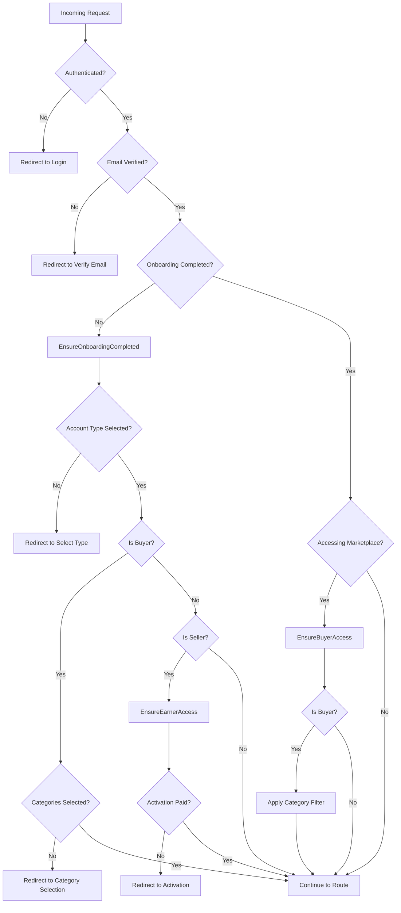

# Buyer Onboarding System Architecture

## System Flow Diagram



## Component Architecture



## Data Flow: Category Filtering



## Database Schema



## Middleware Flow



## Category Selection UI Structure

```
┌─────────────────────────────────────────────────────────────┐
│                  Buyer Category Selection                    │
│         Choose categories you're interested in               │
│              (Minimum 1 category required)                   │
└─────────────────────────────────────────────────────────────┘

┌─────────────────────────────────────────────────────────────┐
│  Professional Services                    [Select All]       │
├─────────────────────────────────────────────────────────────┤
│  ☐ Web Development & Programming                            │
│  ☐ Graphic Design & Branding                                │
│  ☐ Content Writing & Copywriting                            │
│  ☐ Digital Marketing & SEO                                  │
│  ☐ Video Editing & Animation                                │
│  ☐ Virtual Assistant Services                               │
└─────────────────────────────────────────────────────────────┘

┌─────────────────────────────────────────────────────────────┐
│  Digital Products                         [Select All]       │
├─────────────────────────────────────────────────────────────┤
│  ☐ Software & Plugins                                       │
│  ☐ Website Templates & Themes                               │
│  ☐ E-books & Digital Guides                                 │
│  ☐ Online Courses & Tutorials                               │
│  ☐ Graphics & Design Assets                                 │
│  ☐ Music & Audio Files                                      │
└─────────────────────────────────────────────────────────────┘

┌─────────────────────────────────────────────────────────────┐
│  Growth Marketplace                       [Select All]       │
├─────────────────────────────────────────────────────────────┤
│  ☐ Backlinks & SEO Services                                 │
│  ☐ Social Media Growth                                      │
│  ☐ Lead Generation                                          │
│  ☐ Traffic & Advertising                                    │
│  ☐ Influencer Marketing                                     │
└─────────────────────────────────────────────────────────────┘

┌─────────────────────────────────────────────────────────────┐
│  Jobs & Opportunities                     [Select All]       │
├─────────────────────────────────────────────────────────────┤
│  ☐ Remote Jobs                                              │
│  ☐ Freelance Projects                                       │
│  ☐ Part-time Opportunities                                  │
│  ☐ Internships                                              │
└─────────────────────────────────────────────────────────────┘

                    [Continue to Dashboard]
                    
Selected: 0 categories (Minimum 1 required)
```

## Access Control Matrix

| Account Type | Activation Fee | Category Selection | Browse All | Create Listings | Filtered View |
|--------------|----------------|-------------------|------------|-----------------|---------------|
| Earner       | ✅ Required    | ❌ No             | ❌ No      | ❌ No           | ❌ No         |
| Task Creator | ❌ No          | ❌ No             | ✅ Yes     | ✅ Yes          | ❌ No         |
| Freelancer   | ✅ Required    | ❌ No             | ✅ Yes     | ✅ Yes          | ❌ No         |
| Digital Seller| ✅ Required   | ❌ No             | ✅ Yes     | ✅ Yes          | ❌ No         |
| Growth Seller| ✅ Required    | ❌ No             | ✅ Yes     | ✅ Yes          | ❌ No         |
| **Buyer**    | **❌ No**      | **✅ Yes**        | **❌ No**  | **❌ No**       | **✅ Yes**    |

## Implementation Phases

### Phase 1: Database & Models
- Create migration for buyer fields
- Update User model with methods
- Test database operations

### Phase 2: Middleware & Access Control
- Create EnsureBuyerAccess middleware
- Update EnsureEarnerAccess
- Register middleware in Kernel
- Test access control logic

### Phase 3: Onboarding Flow
- Update OnboardingController
- Create category selection view
- Add validation logic
- Test onboarding flow

### Phase 4: Marketplace Filtering
- Update all marketplace controllers
- Add category filtering queries
- Test filtered results
- Verify performance

### Phase 5: Settings & Management
- Add category management to SettingsController
- Create settings view
- Add update functionality
- Test category updates

### Phase 6: Dashboard & UI
- Update dashboard for buyers
- Add category indicators
- Create buyer-specific widgets
- Polish UI/UX

### Phase 7: Testing & Deployment
- End-to-end testing
- Performance testing
- Security audit
- Documentation
- Deployment

## Security Considerations

### Input Validation
- Validate category IDs exist in database
- Ensure minimum 1 category selected
- Prevent SQL injection in category queries
- Sanitize user inputs

### Access Control
- Verify user is authenticated
- Check account type before filtering
- Prevent unauthorized category access
- Rate limit category updates

### Data Integrity
- Use transactions for category updates
- Validate foreign key constraints
- Handle edge cases (deleted categories)
- Maintain audit trail

## Performance Optimization

### Database Queries
- Index `buyer_categories_selected` JSON field
- Cache category lists
- Use eager loading for relationships
- Optimize WHERE IN queries

### Caching Strategy
- Cache marketplace categories
- Cache user category selections
- Invalidate cache on updates
- Use Redis for session data

### Query Optimization
```sql
-- Efficient category filtering
SELECT * FROM professional_services 
WHERE category_id IN (
    SELECT value FROM json_each(
        (SELECT buyer_categories_selected FROM users WHERE id = ?)
    )
)
AND is_active = 1
ORDER BY created_at DESC
LIMIT 20;
```

## Error Handling

### Common Scenarios
1. **No categories selected**: Show validation error
2. **Invalid category ID**: Filter out and show warning
3. **All categories deleted**: Redirect to category selection
4. **Database error**: Show friendly error message
5. **Session timeout**: Redirect to login

### User Feedback
- Clear error messages
- Success confirmations
- Loading indicators
- Helpful tooltips

## Monitoring & Analytics

### Metrics to Track
- Category selection distribution
- Most popular categories
- Buyer conversion rates
- Time to complete onboarding
- Category update frequency

### Logging
- Log category selections
- Track onboarding completion
- Monitor filter performance
- Audit category changes

---

This architecture ensures a scalable, maintainable, and user-friendly buyer onboarding system that integrates seamlessly with the existing SwiftKudi platform.
