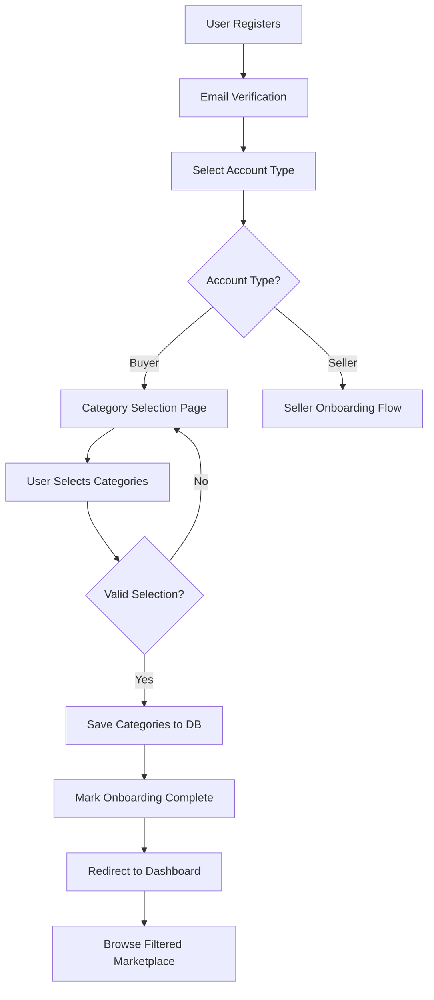

# Buyer Onboarding Implementation Plan

## Overview
This plan outlines the implementation of a buyer onboarding system similar to the existing seller onboarding, but with key differences:
- **No activation fee required** - Buyers can browse immediately
- **Category-based access** - Only selected categories are visible to buyers
- **Simplified flow** - No mandatory creation requirements
- **Flexible preferences** - Buyers can update category selections anytime

## Requirements Confirmed
✅ Buyers can update categories later from settings
✅ Minimum 1 category required during onboarding
✅ "Select All" option available for convenience
✅ Filtering applies to ALL marketplace sections (Professional Services, Digital Products, Growth Marketplace, Jobs)

## Current System Analysis

### Existing Onboarding Flow
The system currently supports multiple account types:
- **Earner**: Requires activation fee (₦1,500), completes starter tasks
- **Task Creator**: Creates tasks to hire workers
- **Freelancer**: Pays activation fee, completes profile, creates first service
- **Digital Seller**: Pays activation fee, uploads first product
- **Growth Seller**: Pays activation fee, creates first listing
- **Buyer**: Basic implementation exists but lacks category selection

### Key Files Involved
1. [`OnboardingController.php`](app/Http/Controllers/OnboardingController.php) - Handles onboarding logic
2. [`EnsureOnboardingCompleted.php`](app/Http/Middleware/EnsureOnboardingCompleted.php) - Forces onboarding completion
3. [`EnsureEarnerAccess.php`](app/Http/Middleware/EnsureEarnerAccess.php) - Controls seller access based on activation
4. [`User.php`](app/Models/User.php) - User model with account type fields
5. [`select-type.blade.php`](resources/views/onboarding/select-type.blade.php) - Account type selection
6. [`buyer.blade.php`](resources/views/onboarding/buyer.blade.php) - Current basic buyer view

## Implementation Requirements

### 1. Database Schema Changes

#### New Migration: `add_buyer_fields_to_users_table`
Add the following fields to the `users` table:
```php
- buyer_categories_selected (JSON) - Stores array of selected category IDs
- buyer_onboarding_completed (boolean) - Tracks if category selection is done
```

### 2. User Model Updates

#### Add to [`User.php`](app/Models/User.php):
```php
// Fillable fields
'buyer_categories_selected',
'buyer_onboarding_completed',

// Casts
'buyer_categories_selected' => 'array',
'buyer_onboarding_completed' => 'boolean',

// Methods
public function getBuyerCategories(): array
public function hasBuyerCategoryAccess(int $categoryId): bool
public function setBuyerCategories(array $categoryIds): void
```

### 3. Middleware Implementation

#### Create New Middleware: `EnsureBuyerAccess`
Purpose: Control buyer access to marketplace sections based on selected categories

**Logic:**
- Check if user is a buyer
- If buyer hasn't selected categories, redirect to category selection
- Filter marketplace content based on selected categories
- Allow access to all buyer-allowed routes (browsing, ordering, messaging)

**Routes to Protect:**
- Professional Services: `/professional-services/*`
- Digital Products: `/digital-products/*`
- Growth Marketplace: `/growth/*`
- Jobs: `/jobs/*`

#### Update [`EnsureEarnerAccess.php`](app/Http/Middleware/EnsureEarnerAccess.php)
- Add buyer account type to exclusion list
- Ensure buyers are not blocked by seller-specific checks

### 4. Controller Updates

#### Update [`OnboardingController.php`](app/Http/Controllers/OnboardingController.php)

**New Methods:**
```php
public function buyerCategorySelection()
{
    // Show category selection interface
    // Display all marketplace categories grouped by type:
    // - Professional Services
    // - Digital Products
    // - Growth Marketplace
    // - Jobs
}

public function storeBuyerCategories(Request $request)
{
    // Validate selected categories
    // Store in user->buyer_categories_selected
    // Mark buyer_onboarding_completed = true
    // Redirect to dashboard
}
```

**Update Existing Method:**
```php
public function storeAccountType(Request $request)
{
    // When buyer is selected:
    // - Set onboarding_completed = false (to force category selection)
    // - Redirect to buyer category selection page
}
```

### 5. View Implementation

#### Update [`buyer.blade.php`](resources/views/onboarding/buyer.blade.php)
Transform from simple welcome page to interactive category selection:

**Features:**
- Display all marketplace categories grouped by type
- Multi-select checkboxes for category selection
- Visual category cards with icons and descriptions
- **Minimum selection requirement: At least 1 category**
- **"Select All" option per category type**
- Clear indication of what each category offers
- Real-time validation feedback

**Layout Structure:**
```
┌─────────────────────────────────────────┐
│  Welcome to SwiftKudi Buyer Onboarding  │
│  Select categories you're interested in │
└─────────────────────────────────────────┘

┌─────────────────────────────────────────┐
│  Professional Services                   │
│  ☐ Web Development                       │
│  ☐ Graphic Design                        │
│  ☐ Content Writing                       │
│  ☐ Digital Marketing                     │
└─────────────────────────────────────────┘

┌─────────────────────────────────────────┐
│  Digital Products                        │
│  ☐ Software & Plugins                    │
│  ☐ Templates & Themes                    │
│  ☐ E-books & Courses                     │
└─────────────────────────────────────────┘

┌─────────────────────────────────────────┐
│  Growth Marketplace                      │
│  ☐ Backlinks & SEO                       │
│  ☐ Social Media Growth                   │
│  ☐ Lead Generation                       │
└─────────────────────────────────────────┘

[Continue to Dashboard]
```

### 6. Marketplace Controller Updates

Update the following controllers to filter by buyer categories:

#### [`ProfessionalServiceController.php`](app/Http/Controllers/ProfessionalServiceController.php)
```php
public function index(Request $request)
{
    $query = ProfessionalService::active();
    
    // Add buyer category filter
    if (Auth::user()->account_type === 'buyer') {
        $buyerCategories = Auth::user()->buyer_categories_selected ?? [];
        if (!empty($buyerCategories)) {
            $query->whereIn('category_id', $buyerCategories);
        }
    }
    
    // ... rest of the logic
}
```

#### [`DigitalProductController.php`](app/Http/Controllers/DigitalProductController.php)
Apply same filtering logic for digital products

#### [`GrowthController.php`](app/Http/Controllers/GrowthController.php)
Apply same filtering logic for growth listings

#### [`JobController.php`](app/Http/Controllers/JobController.php)
Apply same filtering logic for job listings

### 7. Route Configuration

#### Add to [`web.php`](routes/web.php)
```php
// Buyer onboarding routes
Route::get('/onboarding/buyer/categories', [OnboardingController::class, 'buyerCategorySelection'])
    ->name('onboarding.buyer.categories');
Route::post('/onboarding/buyer/categories', [OnboardingController::class, 'storeBuyerCategories'])
    ->name('onboarding.buyer.categories.store');

// Apply buyer middleware to marketplace routes
Route::middleware(['buyer.access'])->group(function () {
    // Professional services, digital products, growth, jobs
});
```

### 8. Dashboard Updates

#### Update [`dashboard.blade.php`](resources/views/dashboard.blade.php)
Add buyer-specific dashboard section:
- Show only selected categories
- Quick links to browse each category
- Option to modify category preferences
- Recent orders and activity

## Implementation Flow Diagram



## Key Differences from Seller Onboarding

| Feature | Seller Onboarding | Buyer Onboarding |
|---------|------------------|------------------|
| Activation Fee | Required (₦1,500) | **Not Required** |
| Mandatory Creation | Must create product/service | **No creation needed** |
| Access Control | Gated until activation | **Immediate access** |
| Category Selection | Not applicable | **Required** |
| Marketplace Visibility | Full access after activation | **Filtered by categories** |

## Security Considerations

1. **Category Validation**: Ensure selected categories exist and are active
2. **Access Control**: Buyers cannot access seller-only features (creating listings)
3. **Data Integrity**: Validate category IDs before storing
4. **Middleware Order**: Ensure buyer middleware runs after authentication

## Testing Checklist

- [ ] User can select buyer account type
- [ ] Category selection page displays all categories
- [ ] User can select multiple categories
- [ ] Validation prevents empty category selection
- [ ] Categories are saved correctly to database
- [ ] Marketplace shows only selected categories
- [ ] Buyer cannot access seller-only features
- [ ] Buyer can browse and order without activation fee
- [ ] Dashboard shows buyer-specific content
- [ ] Category preferences can be updated later

## Migration Path for Existing Buyers

For users who already have `account_type = 'buyer'`:
1. Run migration to add new fields
2. Set `buyer_onboarding_completed = false` for existing buyers
3. On next login, redirect to category selection
4. Allow "Skip for now" option with default to all categories

## Buyer Settings - Category Management

### Add to [`SettingsController.php`](app/Http/Controllers/SettingsController.php)

**New Methods:**
```php
public function buyerCategoriesForm()
{
    // Show category preferences page
    // Display current selections
    // Allow updates
}

public function updateBuyerCategories(Request $request)
{
    // Validate: minimum 1 category
    // Update user->buyer_categories_selected
    // Flash success message
    // Redirect back to settings
}
```

**Settings Page Section:**
Add "Category Preferences" section for buyers:
- Display currently selected categories
- Allow adding/removing categories
- Show "Select All" / "Deselect All" options
- Real-time preview of what will be visible

## Future Enhancements

1. **Smart Recommendations**: Suggest categories based on browsing history
2. **Category Analytics**: Track which categories buyers prefer
3. **Personalized Dashboard**: Show trending items in selected categories
4. **Email Notifications**: Notify buyers of new items in their categories
5. **Advanced Filtering**: Sub-category level filtering within main categories

## Files to Create/Modify

### New Files
1. `database/migrations/YYYY_MM_DD_HHMMSS_add_buyer_fields_to_users_table.php`
2. `app/Http/Middleware/EnsureBuyerAccess.php`
3. `resources/views/settings/buyer-categories.blade.php` (category preferences page)

### Modified Files
1. `app/Http/Controllers/OnboardingController.php` - Add category selection methods
2. `app/Models/User.php` - Add buyer fields and helper methods
3. `resources/views/onboarding/buyer.blade.php` - Transform to category selection UI
4. `app/Http/Middleware/EnsureEarnerAccess.php` - Exclude buyers from seller checks
5. `app/Http/Controllers/ProfessionalServiceController.php` - Add category filtering
6. `app/Http/Controllers/DigitalProductController.php` - Add category filtering
7. `app/Http/Controllers/GrowthController.php` - Add category filtering
8. `app/Http/Controllers/JobController.php` - Add category filtering
9. `app/Http/Controllers/SettingsController.php` - Add category management methods
10. `routes/web.php` - Add buyer onboarding and settings routes
11. `app/Http/Kernel.php` - Register new middleware
12. `resources/views/dashboard.blade.php` - Add buyer-specific sections
13. `resources/views/settings/index.blade.php` - Add category preferences link

## Estimated Implementation Steps

1. **Database Layer** - Create migration and update User model
2. **Middleware Layer** - Create buyer access middleware
3. **Controller Layer** - Update OnboardingController with category logic
4. **View Layer** - Build category selection interface
5. **Integration Layer** - Update marketplace controllers with filtering
6. **Testing Layer** - Comprehensive testing of buyer flow
7. **Documentation** - Update user documentation

## Success Criteria

✅ Buyers can complete onboarding without paying activation fee
✅ Buyers can select preferred categories during onboarding
✅ Marketplace shows only selected categories to buyers
✅ Buyers can browse and purchase immediately after onboarding
✅ Existing seller onboarding flows remain unaffected
✅ All middleware properly handles buyer account type
✅ Dashboard displays buyer-specific content

---

**Note**: This implementation maintains backward compatibility with existing onboarding flows while adding buyer-specific functionality. The category-based filtering ensures buyers have a personalized experience without overwhelming them with irrelevant content.
