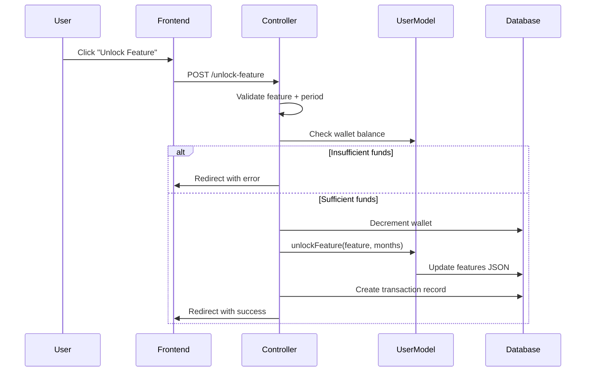
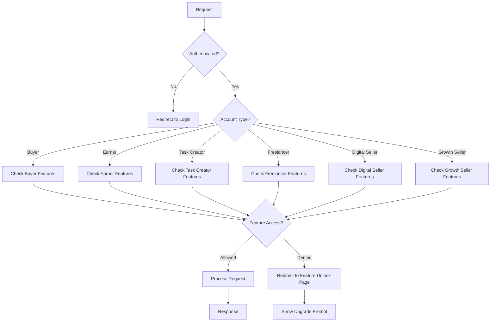

# Role-Based Feature Access and Plan Architecture Implementation Plan

## Executive Summary

This document outlines the implementation of a comprehensive role-based feature access system for SwiftKudi. The system will provide each account type (Buyer, Earner, Task Creator, Freelancer, Digital Seller, Growth Seller) with distinct access rules, plan architecture, and feature unlocking capabilities.

---

## 1. Current System Analysis

### 1.1 Existing Components

| Component | Status | Location |
|-----------|--------|----------|
| User Model (account_type) | ✅ Implemented | `app/Models/User.php` |
| Earner Feature Unlock System | ✅ Implemented | `app/Models/User.php` (unlockEarnerFeature) |
| Buyer Category Selection | ✅ Implemented | `app/Http/Controllers/OnboardingController.php` |
| EnsureEarnerAccess Middleware | ✅ Implemented | `app/Http/Middleware/EnsureEarnerAccess.php` |
| EnsureBuyerAccess Middleware | ✅ Implemented | `app/Http/Middleware/EnsureBuyerAccess.php` |
| SubscriptionPlan Model | ✅ Implemented | `app/Models/SubscriptionPlan.php` |
| UserSubscription Model | ✅ Implemented | `app/Models/UserSubscription.php` |

### 1.2 Gaps Identified

1. **No Unified Plan Architecture per Role** - Each role needs its own plan structure
2. **Feature Unlock Not Extended to All Roles** - Only earners have feature unlocking
3. **Missing Buyer Feature Locking** - Buyers can currently access all marketplace features
4. **No Per-Feature Pricing Model** - Need ₦1,000 initial + ₦500/₦1,000 recurring
5. **Missing Task Creator Plan** - No specific plan architecture
6. **Missing Freelancer Plan** - No specific plan for professional services access
7. **No Digital/Growth Seller Plans** - Only have basic activation, not feature plans

---

## 2. System Architecture

### 2.1 Role Definitions and Access Matrix

```mermaid
graph TD
    subgraph Roles
        A[Buyer]
        B[Earner]
        C[Task Creator]
        D[Freelancer]
        E[Digital Seller]
        F[Growth Seller]
    end
    
    subgraph Features
        G[Start Journey]
        H[Task Creation]
        I[Available Tasks]
        J[Professional Services]
        K[Growth Listings]
        L[Digital Products]
    end
    
    A -->|View Only| G
    A -->|Restricted| H
    A -->|View Only| J
    A -->|View Only| K
    A -->|View Only| L
    
    B -->|Restricted| G
    B -->|Unlock Required| H
    B -->|Unlock Required| I
    B -->|Unlock Required| J
    B -->|Unlock Required| K
    B -->|Unlock Required| L
    
    C -->|Full Access| H
    C -->|Restricted| I
    C -->|Restricted| J
    C -->|Restricted| K
    C -->|Restricted| L
    
    D -->|Restricted| H
    D -->|Restricted| I
    D -->|Full Access| J
    D -->|View Only| K
    D -->|Restricted| L
    
    E -->|Restricted| H
    E -->|Restricted| I
    E -->|Restricted| J
    E -->|Restricted| K
    E -->|Full Access| L
    
    F -->|Restricted| H
    F -->|Restricted| I
    F -->|Restricted| J
    F -->|Full Access| K
    F -->|Restricted| L
```



### 2.2 Feature Access Levels

| Access Level | Code | Description |
|--------------|------|-------------|
| Full Access | `full` | Can view, create, edit, delete |
| View Only | `view` | Can view and order, cannot create |
| Restricted | `restricted` | Cannot access without unlock |
| None | `none` | Never accessible for this role |

### 2.3 Feature Definitions

| Feature Key | Display Name | Description |
|-------------|--------------|-------------|
| `start_journey` | Start Journey Page | Earner onboarding/earnings page |
| `task_creation` | Task Creation | Create campaign/task functionality |
| `available_tasks` | Available Tasks | Browse and work on available tasks |
| `professional_services` | Professional Services | Browse and hire professionals |
| `growth_listings` | Growth Listings | Browse and purchase growth services |
| `digital_products` | Digital Products | Browse and purchase digital products |

---

## 3. Detailed Role Requirements

### 3.1 Buyer Plan

**Activation Required:** No

**Default Access:**
| Feature | Access Level | Unlock Cost |
|---------|--------------|-------------|
| Start Journey Page | ❌ Restricted | ₦1,000 + ₦500/3mo or ₦1,000/6mo |
| Task Creation | ❌ Restricted | ₦1,000 + ₦500/3mo or ₦1,000/6mo |
| Available Tasks | ❌ Restricted | ₦1,000 + ₦500/3mo or ₦1,000/6mo |
| Professional Services | 👁️ View Only | Free |
| Growth Listings | 👁️ View Only | Free |
| Digital Products | 👁️ View Only | Free |

**Onboarding:**
- NO activation fee
- Must select categories during onboarding
- Does NOT show activation feature on Start Journey page

**Implementation Notes:**
- Add `buyer_feature_access` JSON field to track unlocked features
- Create `hasBuyerFeature()` method in User model
- Update middleware to check buyer-specific access
- Hide Create Task button from dashboard
- Hide Start Journey link from buyer dashboard

### 3.2 Earner Plan

**Activation Required:** Yes (₦1,500)

**Default Access (Before Unlock):**
| Feature | Access Level | Unlock Cost |
|---------|--------------|-------------|
| Start Journey Page | ⚠️ Partial | Free (shows gate) |
| Task Creation | ❌ Restricted | ₦1,000 + ₦500/3mo or ₦1,000/6mo |
| Available Tasks | ❌ Restricted | ₦1,000 + ₦500/3mo or ₦1,000/6mo |
| Professional Services | ❌ Restricted | ₦1,000 + ₦500/3mo or ₦1,000/6mo |
| Growth Listings | ❌ Restricted | ₦1,000 + ₦500/3mo or ₦1,000/6mo |
| Digital Products | ❌ Restricted | ₦1,000 + ₦500/3mo or ₦1,000/6mo |

**Current Implementation:** Already exists via `earner_features` JSON field

**Enhancements Needed:**
- Add Start Journey as unlockable feature
- Add Available Tasks as unlockable feature
- Ensure pricing matches: ₦1,000 initial, ₦500/month, ₦1,000/quarter

### 3.3 Task Creator Plan

**Activation Required:** No

**Default Access:**
| Feature | Access Level | Unlock Cost |
|---------|--------------|-------------|
| Start Journey Page | 👁️ View Only | Free |
| Task Creation | ✅ Full | Free |
| Available Tasks | ❌ Restricted | ₦1,000 + ₦500/3mo or ₦1,000/6mo |
| Professional Services | ❌ Restricted | ₦1,000 + ₦500/3mo or ₦1,000/6mo |
| Growth Listings | ❌ Restricted | ₦1,000 + ₦500/3mo or ₦1,000/6mo |
| Digital Products | ❌ Restricted | ₦1,000 + ₦500/3mo or ₦1,000/6mo |

**Onboarding:**
- No activation fee
- Must create first task before marketplace access
- Already partially implemented via `has_completed_mandatory_creation`

**Implementation Notes:**
- Add `task_creator_features` JSON field
- Create `hasTaskCreatorFeature()` method
- Restrict Available Tasks, Professional Services, Growth, Digital Products by default
- Hide "Available Tasks" button from dashboard
- Hide "Hire" button from dashboard
- Hide "Growth" button from dashboard
- Hide "Products" button from dashboard

### 3.4 Freelancer Plan

**Activation Required:** No (but profile completion required)

**Default Access:**
| Feature | Access Level | Unlock Cost |
|---------|--------------|-------------|
| Start Journey Page | 👁️ View Only | Free |
| Task Creation | ❌ Restricted | ₦1,000 + ₦500/3mo or ₦1,000/6mo |
| Available Tasks | ❌ Restricted | ₦1,000 + ₦500/3mo or ₦1,000/6mo |
| Professional Services | ✅ Full | Free (after profile + service) |
| Growth Listings | ❌ Restricted | ₦1,000 + ₦500/3mo or ₦1,000/6mo |
| Digital Products | ❌ Restricted | ₦1,000 + ₦500/3mo or ₦1,000/6mo |

**Onboarding:**
- No activation fee
- Must complete freelancer profile
- Must create first service
- Already partially implemented via `freelancer_profile_completed`, `freelancer_service_created`

**Implementation Notes:**
- Add `freelancer_features` JSON field for unlockable features
- Ensure Available Tasks is restricted (hide button)
- Ensure Task Creation is restricted (hide button)
- Ensure Growth Listings is restricted (hide button)
- Ensure Digital Products is restricted (hide button)

### 3.5 Digital Seller Plan

**Activation Required:** No (but product upload required)

**Default Access:**
| Feature | Access Level | Unlock Cost |
|---------|--------------|-------------|
| Start Journey Page | 👁️ View Only | Free |
| Task Creation | ❌ Restricted | ₦1,000 + ₦500/3mo or ₦1,000/6mo |
| Available Tasks | ❌ Restricted | ₦1,000 + ₦500/3mo or ₦1,000/6mo |
| Professional Services | ❌ Restricted | ₦1,000 + ₦500/3mo or ₦1,000/6mo |
| Growth Listings | ❌ Restricted | ₦1,000 + ₦500/3mo or ₦1,000/6mo |
| Digital Products | ✅ Full | Free (after first product) |

**Onboarding:**
- No activation fee
- Must upload first product
- Already partially implemented via `digital_product_uploaded`

**Implementation Notes:**
- Add `digital_seller_features` JSON field for unlockable features
- Ensure Task Creation is restricted (hide button)
- Ensure Available Tasks is restricted (hide button)
- Ensure Professional Services is restricted (hide button)
- Ensure Growth Listings is restricted (hide button)

### 3.6 Growth Seller Plan

**Activation Required:** No (but listing creation required)

**Default Access:**
| Feature | Access Level | Unlock Cost |
|---------|--------------|-------------|
| Start Journey Page | 👁️ View Only | Free |
| Task Creation | ❌ Restricted | ₦1,000 + ₦500/3mo or ₦1,000/6mo |
| Available Tasks | ❌ Restricted | ₦1,000 + ₦500/3mo or ₦1,000/6mo |
| Professional Services | ❌ Restricted | ₦1,000 + ₦500/3mo or ₦1,000/6mo |
| Growth Listings | ✅ Full | Free (after first listing) |
| Digital Products | ❌ Restricted | ₦1,000 + ₦500/3mo or ₦1,000/6mo |

**Onboarding:**
- No activation fee
- Must create first growth listing
- Already partially implemented via `growth_listing_created`

**Implementation Notes:**
- Add `growth_seller_features` JSON field for unlockable features
- Ensure Task Creation is restricted (hide button)
- Ensure Available Tasks is restricted (hide button)
- Ensure Professional Services is restricted (hide button)
- Ensure Digital Products is restricted (hide button)

---

## 4. Implementation Components

### 4.1 Database Schema Changes

**New Fields in `users` table:**

```php
// Buyer features (JSON)
$table->json('buyer_features')->nullable();

// Task Creator features (JSON)
$table->json('task_creator_features')->nullable();

// Freelancer features (JSON)
$table->json('freelancer_features')->nullable();

// Digital Seller features (JSON)
$table->json('digital_seller_features')->nullable();

// Growth Seller features (JSON)
$table->json('growth_seller_features')->nullable();
```

### 4.2 User Model Updates

Add the following methods to `app/Models/User.php`:

```php
// Buyer methods
public function hasBuyerFeature(string $feature): bool
public function unlockBuyerFeature(string $feature, int $months = 3): void

// Task Creator methods
public function hasTaskCreatorFeature(string $feature): bool
public function unlockTaskCreatorFeature(string $feature, int $months = 3): void

// Freelancer methods
public function hasFreelancerFeature(string $feature): bool
public function unlockFreelancerFeature(string $feature, int $months = 3): void

// Digital Seller methods
public function hasDigitalSellerFeature(string $feature): bool
public function unlockDigitalSellerFeature(string $feature, int $months = 3): void

// Growth Seller methods
public function hasGrowthSellerFeature(string $feature): bool
public function unlockGrowthSellerFeature(string $feature, int $months = 3): void
```

### 4.3 Middleware Updates

#### Update `EnsureEarnerAccess.php`

Current logic handles earners. Need to expand for all roles:

```php
// Add role-specific access checks
switch ($user->account_type) {
    case 'buyer':
        return $this->handleBuyerAccess($request, $next);
    case 'task_creator':
        return $this->handleTaskCreatorAccess($request, $next);
    case 'freelancer':
        return $this->handleFreelancerAccess($request, $next);
    case 'digital_seller':
        return $this->handleDigitalSellerAccess($request, $next);
    case 'growth_seller':
        return $this->handleGrowthSellerAccess($request, $next);
    default:
        return $next($request);
}
```

### 4.4 Controller Updates

#### Update `OnboardingController.php`

Add feature unlock methods for each role:

```php
public function unlockBuyerFeature(Request $request)
public function unlockTaskCreatorFeature(Request $request)
public function unlockFreelancerFeature(Request $request)
public function unlockDigitalSellerFeature(Request $request)
public function unlockGrowthSellerFeature(Request $request)
```

#### Update `StartJourneyController.php`

- For Buyers: Hide activation feature, show only feature unlock options
- For Task Creators: Show feature unlock options
- For Freelancers: Show feature unlock options
- For Digital Sellers: Show feature unlock options
- For Growth Sellers: Show feature unlock options

### 4.5 View Updates

#### Update `resources/views/dashboard.blade.php`

Add conditional rendering based on account type:

```blade
{{-- Buyer: Hide Create Task, Start Journey --}}
@if(auth()->user()->account_type !== 'buyer')
    <a href="{{ route('tasks.create') }}">Create Task</a>
@endif

@if(auth()->user()->account_type !== 'buyer' || auth()->user()->hasBuyerFeature('start_journey'))
    <a href="{{ route('start-your-journey') }}">Start Journey</a>
@endif

{{-- Hide based on role restrictions --}}
@canAccessFeature('available_tasks')
    <a href="{{ route('tasks.index') }}">Available Tasks</a>
@endcanAccessFeature

@canAccessFeature('professional_services')
    <a href="{{ route('professional-services.index') }}">Hire</a>
@endcanAccessFeature

@canAccessFeature('growth_listings')
    <a href="{{ route('growth.index') }}">Growth</a>
@endcanAccessFeature

@canAccessFeature('digital_products')
    <a href="{{ route('digital-products.index') }}">Products</a>
@endcanAccessFeature
```

#### Update `resources/views/start-journey/index.blade.php`

- Hide activation section for buyers
- Show feature unlock section for all roles
- Customize available features based on account type

### 4.6 Pricing Configuration

| Feature | Initial Price | Monthly (3mo) | Quarterly (6mo) |
|---------|---------------|---------------|-----------------|
| Start Journey | ₦1,000 | ₦500/mo | ₦1,000/quarter |
| Task Creation | ₦1,000 | ₦500/mo | ₦1,000/quarter |
| Available Tasks | ₦1,000 | ₦500/mo | ₦1,000/quarter |
| Professional Services | ₦1,000 | ₦500/mo | ₦1,000/quarter |
| Growth Listings | ₦1,000 | ₦500/mo | ₦1,000/quarter |
| Digital Products | ₦1,000 | ₦500/mo | ₦1,000/quarter |

---

## 5. Implementation Phases

### Phase 1: Database & Model Updates

**Tasks:**
- [ ] Create migration for new JSON fields
- [ ] Update User model with new methods
- [ ] Add feature constants

**Files:**
- `database/migrations/XXXX_XX_XX_add_role_features_to_users.php`
- `app/Models/User.php`

### Phase 2: Middleware Implementation

**Tasks:**
- [ ] Update EnsureEarnerAccess middleware
- [ ] Create role-specific access handlers
- [ ] Add feature checking logic

**Files:**
- `app/Http/Middleware/EnsureEarnerAccess.php`

### Phase 3: Controller Implementation

**Tasks:**
- [ ] Add unlock methods to OnboardingController
- [ ] Add feature unlock routes
- [ ] Update StartJourneyController for all roles

**Files:**
- `app/Http/Controllers/OnboardingController.php`
- `app/Http/Controllers/StartJourneyController.php`
- `routes/web.php`

### Phase 4: View Implementation

**Tasks:**
- [ ] Update dashboard.blade.php with role-based buttons
- [ ] Update start-journey/index.blade.php for all roles
- [ ] Add feature unlock UI components

**Files:**
- `resources/views/dashboard.blade.php`
- `resources/views/start-journey/index.blade.php`

### Phase 5: Integration & Testing

**Tasks:**
- [ ] Test each role's access flow
- [ ] Test feature unlock payment flow
- [ ] Verify button visibility rules
- [ ] Test route protection

---

## 6. Mermaid Diagrams

### 6.1 Feature Unlock Flow



### 6.2 Access Control Flow



---

## 7. Files to Modify

| File | Action | Description |
|------|--------|-------------|
| `app/Models/User.php` | Modify | Add feature unlock methods for each role |
| `app/Http/Controllers/OnboardingController.php` | Modify | Add unlock endpoints for each role |
| `app/Http/Controllers/StartJourneyController.php` | Modify | Update view data for all roles |
| `app/Http/Middleware/EnsureEarnerAccess.php` | Modify | Expand access control for all roles |
| `routes/web.php` | Modify | Add feature unlock routes |
| `resources/views/dashboard.blade.php` | Modify | Add role-based button visibility |
| `resources/views/start-journey/index.blade.php` | Modify | Update for all roles |
| `database/migrations/XXXX_XX_XX_add_role_features.php` | Create | Add JSON fields for each role |

---

## 8. Success Criteria

- [ ] Each role has distinct dashboard with appropriate buttons
- [ ] Buyers cannot see Start Journey or Create Task buttons
- [ ] All roles can unlock features via payment
- [ ] Feature unlock pricing is consistent (₦1,000 + ₦500/₦1,000)
- [ ] Route protection works for all roles
- [ ] View-only access works for allowed features
- [ ] Onboarding flows remain functional for all roles

---

## 9. Risk Mitigation

| Risk | Mitigation |
|------|------------|
| Breaking existing functionality | Test extensively after each phase |
| Payment processing errors | Add robust error handling and logging |
| Feature state inconsistency | Use database transactions for updates |
| Performance impact | Optimize JSON queries, add indexes |

---

*This plan was generated based on analysis of the existing SwiftKudi codebase and the requirements specified for role-based feature access.*